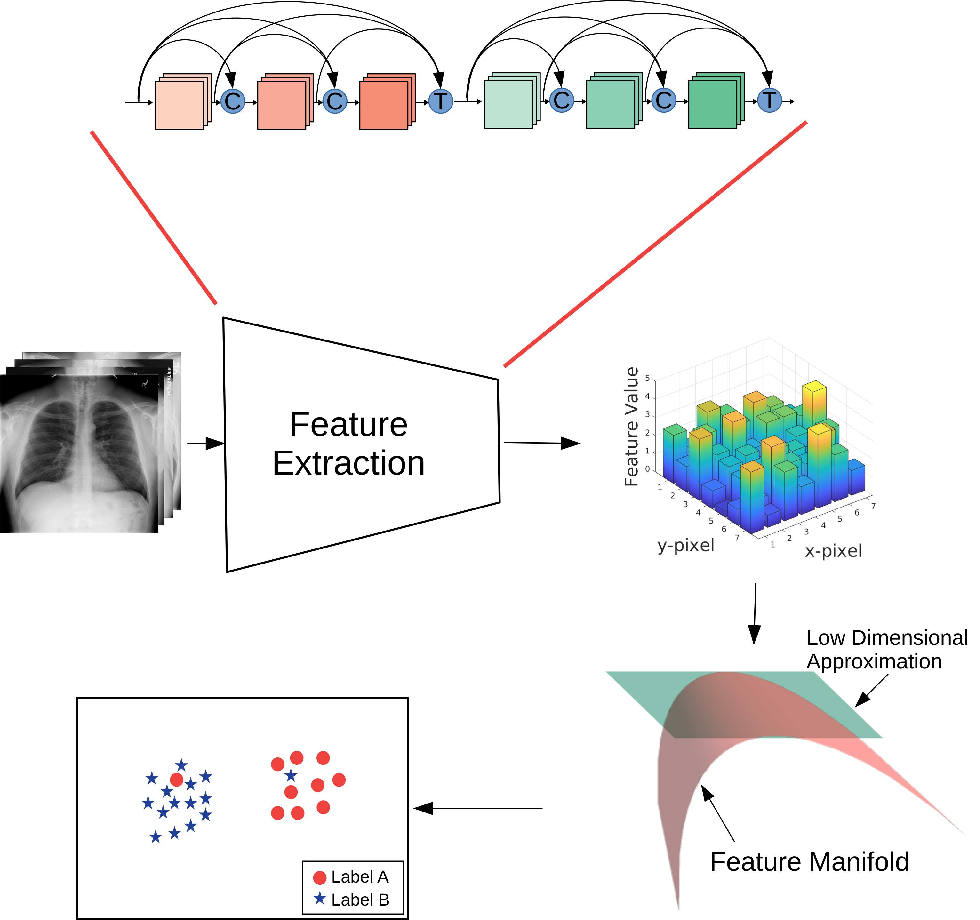
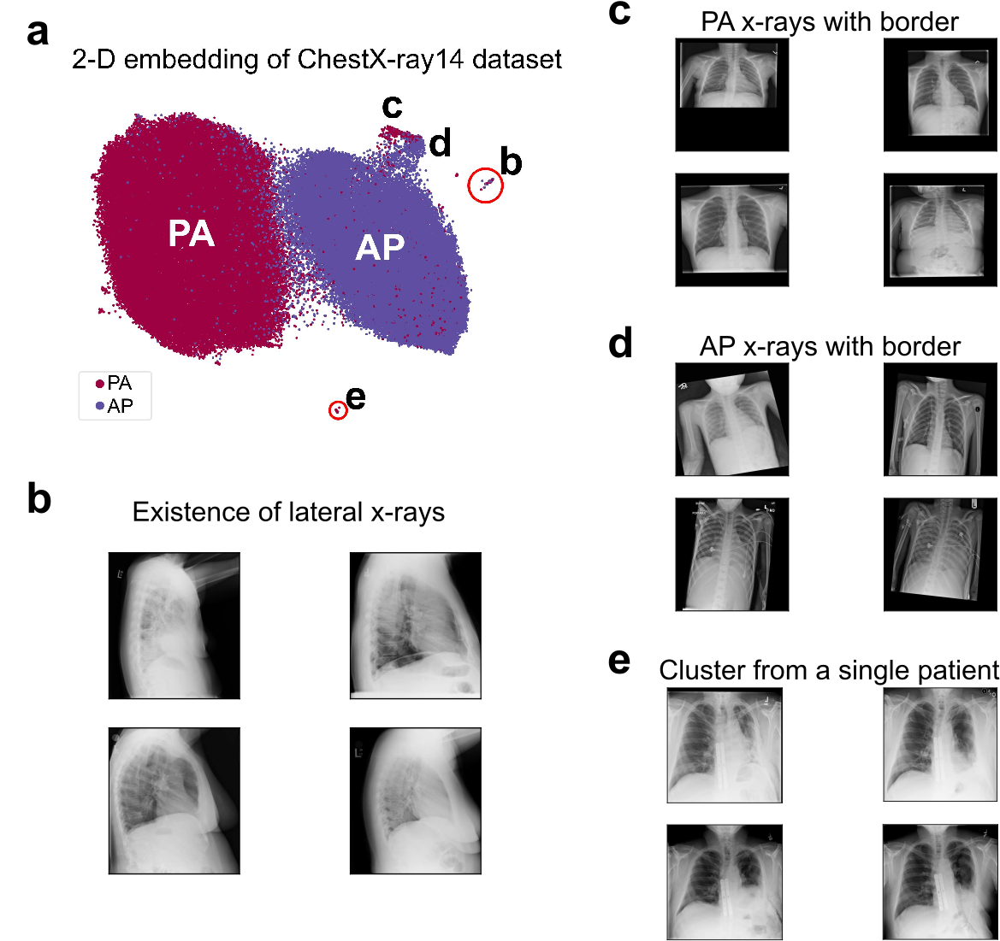
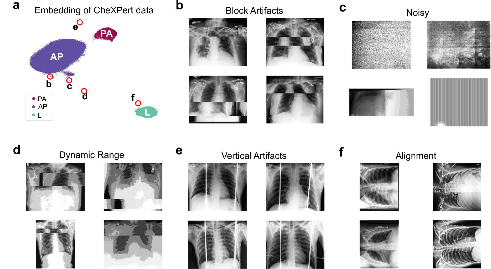
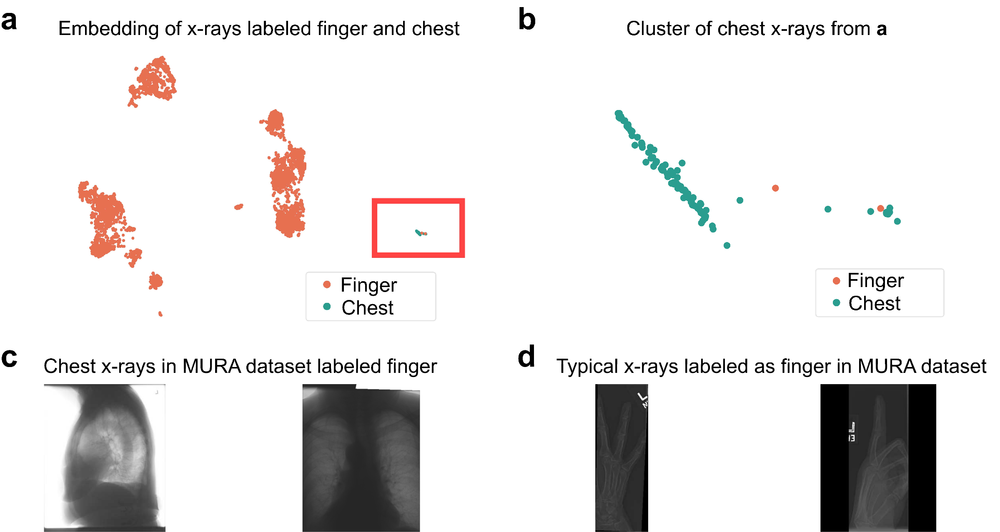
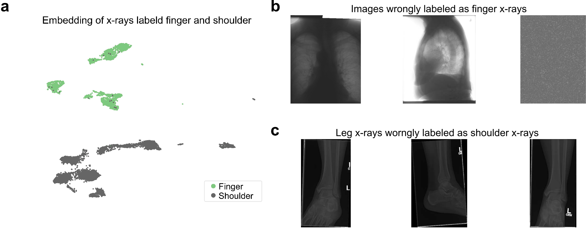
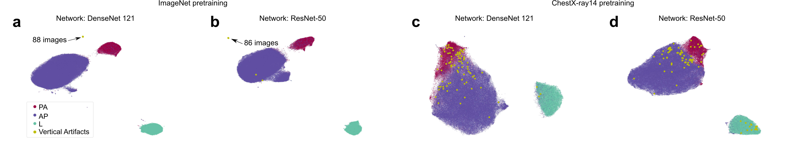

# Outlier Detection in Large Radiological Datasets using UMAP

This repository contains code and examples for the paper:

> **Outlier Detection in Large Radiological Datasets using UMAP**
> Mohammad Tariqul Islam and Jason W. Fleischer
>
> MICCAI 2024 Workshop on Topology- and Graph-Informed Imaging Informatics (TGI3)
>
> Paper link: [https://arxiv.org/abs/2407.21263](https://arxiv.org/abs/2407.21263)

## Overview

Large biomedical datasets often contain mislabeled, corrupted, duplicated, or otherwise inconsistent samples. These issues are especially common when datasets are assembled from multiple sources or when labels are generated through automated tools, reports, or human annotation pipelines.

In this work, we use **UMAP-based neighbor embedding** as a visual analytics tool for dataset curation. The key idea is simple:

> Outlier images are often different from the main dataset, but similar to other images with the same error type.
> UMAP can reveal these error types as small satellite clusters separated from the main data manifold.

We apply this approach to large public radiological datasets, including:

- **ChestX-ray14**
- **CheXpert**
- **MURA**

The method identifies several types of dataset issues, including incorrect views, corrupted images, acquisition artifacts, dynamic-range problems, and mislabeled radiographs.

## Method
<p align="center">

</p>

**Schematic of the outlier search algorithm.** Image features extracted from a DenseNet-121 neural network are projected onto a low-dimensional space (2-D plane) using UMAP.


## Main Findings

### ChestX-ray14

<p align="center">

</p>

**Outlier detection in the ChestX-ray14 dataset.** (a) 2-D embedding. Labeled clusters from (a) are: (b) Lateral x-rays which were not supposed to be in the dataset, (c) PA x-rays with borders, (d) AP x-rays with borders, and (e) cluster from a single patient.

### CheXpert



**Outlier detection in the CheXpert dataset.** (a) 2-D Embedding. Example images with (b) block artifacts, (c) noise, (d) improper dynamic range, (e) vertical artifacts, and (f) alignment issues.

### MURA



**Embedding of 'finger' x-rays from MURA dataset and 100 chest x-rays from CheXpert dataset using UMAP.** (a) Scatter plot of the embedding. The cluster of chest x-rays is marked using a red rectangle. (b) Scatter plot in the red rectangle. (c) two x-rays labeled `finger' are actually chest x-rays. (d) Typical finger x-rays from the MURA dataset.



**Embedding of 'finger' and 'shoulder' x-rays from MURA dataset using UMAP.** (a) 2-D scatterplot of the embedding. (b) Chest x-ray and non-x-ray images were discovered which are labeled as 'finger' x-rays. (c) Leg x-rays labeled as 'shoulder' x-rays.

### Choosing Appropriate Pre-trained Network is Important



**Embedding of CheXpert dataset using different pre-trained models.** DenseNet-121 and ResNet-50 trained on ImageNet (left two) and ChestX-ray14 (right tow) datasets. Each yellow point represents an image with vertical artifact indicating chest x-ray pre-trained models fail to identify these as outliers.


## Data

This repository does **not** host the full medical imaging datasets. Please download the datasets from their official sources and follow their respective data-use agreements.

Datasets used in the paper:

- [ChestX-ray14](https://nihcc.app.box.com/v/ChestXray-NIHCC)
- [CheXpert](https://stanfordmlgroup.github.io/competitions/chexpert/)
- [MURA](https://stanfordmlgroup.github.io/competitions/mura/)

After downloading, update the dataset paths inside the relevant notebooks.

## Running the Notebooks

### ChestX-ray14

```text
code/ChestX-ray14/CXR14_data_process.ipynb
code/ChestX-ray14/CXR_UMAP.ipynb
```

Use these notebooks to preprocess ChestX-ray14 images, extract features, and generate UMAP embeddings.

### CheXpert

```text
code/CheXpert/ChexpertV1.0-Image_Processing.ipynb
code/CheXpert/CHEXPERT_DATA_py3-Complete Dataset_UMAP.ipynb
```

Use these notebooks to process CheXpert images, extract DenseNet features, and inspect artifact clusters.

Additional folders contain experiments using alternate models and TorchXRayVision models.

### MURA

```text
code/MURA/MURA_DATASET_prepare.ipynb
code/MURA/Dataset_seeding_Finger.ipynb
code/MURA/Dataset_pair_analysis- Finger and Shoulder.ipynb
```

Use these notebooks to prepare the MURA dataset and run seeded outlier-search experiments.

## Example Use Cases

This workflow can be used for:

- Dataset quality control
- Medical image dataset curation
- Outlier and artifact discovery
- Label-error detection
- Visual audit of large-scale image collections
- Pre-deployment inspection of training data for clinical AI models

Although this paper focuses on radiological images, the graph-based workflow can be adapted to other high-dimensional datasets, including biomedical signals, microscopy images, multimodal datasets, and representation spaces from deep learning models.

## Citation

If you find this work useful, please cite:

```
@inproceedings{islam2024outlier,
  title={Outlier detection in large radiological datasets using umap},
  author={Islam, Mohammad Tariqul and Fleischer, Jason W},
  booktitle={International Workshop on Topology-and Graph-Informed Imaging Informatics},
  pages={111--121},
  year={2024},
  organization={Springer}
}

```

## Disclaimer

This repository is intended for research and dataset-curation purposes only. It is not a clinical diagnostic tool and should not be used for medical decision-making.
